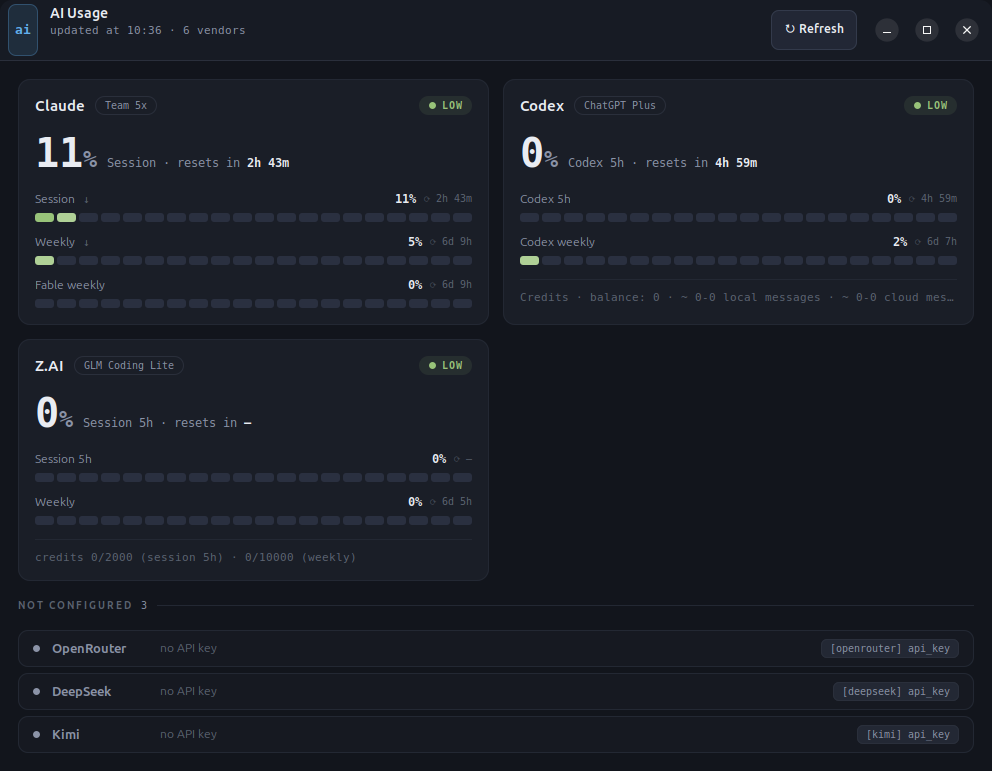

# AI Usage Popup

A small GTK popup for Linux that shows, in one window, how much of each AI plan you have used: **Claude**, **Codex (OpenAI)**, **Z.AI**, **OpenRouter**, **DeepSeek** and **Kimi**. Each card shows the usage of every window (session, weekly…) and how long until it resets.



It reads the vendors through [ai-usagebar](https://github.com/akitaonrails/ai-usagebar), the Waybar widget by Fabio Akita, so it works with the same configuration. Z.AI is the exception: the popup calls the Z.AI quota API directly, because ai-usagebar does not map the credit limits that Lite plans report.

## Features

- One card per vendor, with a gauge per usage window and the time left until each reset.
- All vendors are read in parallel; a slow or broken vendor does not hold up the others.
- Vendors without credentials are grouped under **Not configured**, with the setting that is missing.
- **↻ Refresh** button, and the time of the last update.
- Single Python file, no dependencies beyond GTK.

## Requirements

- Linux with GTK 3
- Python 3.11 or newer with PyGObject (Debian/Ubuntu: `sudo apt install python3-gi gir1.2-gtk-3.0`)
- [ai-usagebar](https://github.com/akitaonrails/ai-usagebar) installed and configured for the vendors you use

## Install

```bash
git clone https://github.com/dhanyel/ai-usage-popup.git
cd ai-usage-popup
./install.sh
```

This installs `~/.local/bin/ai-usage-popup`, a launcher (**AI Usage Popup** in your applications menu) and its icon. No sudo. To remove it: `./install.sh --uninstall`.

You can also run it straight from the checkout: `./ai-usage-popup`.

## Configuration

Vendor credentials live in ai-usagebar's `~/.config/ai-usagebar/config.toml`; see its README.

For Z.AI, the popup reads the API key from the same file:

```toml
[zai]
api_key = "your-z.ai-key"
```

or, if it is not there, from the `ZAI_API_KEY` environment variable. Prefer the file: a desktop launcher does not see variables exported in `~/.bashrc`.

## Development

```bash
python3 -m unittest -v
```

The tests cover the Z.AI response parsing and error handling, the ai-usagebar output parsing and the formatting helpers. CI runs them on Ubuntu 24.04.

## License

[MIT](LICENSE) © Dhanyel Nunes
